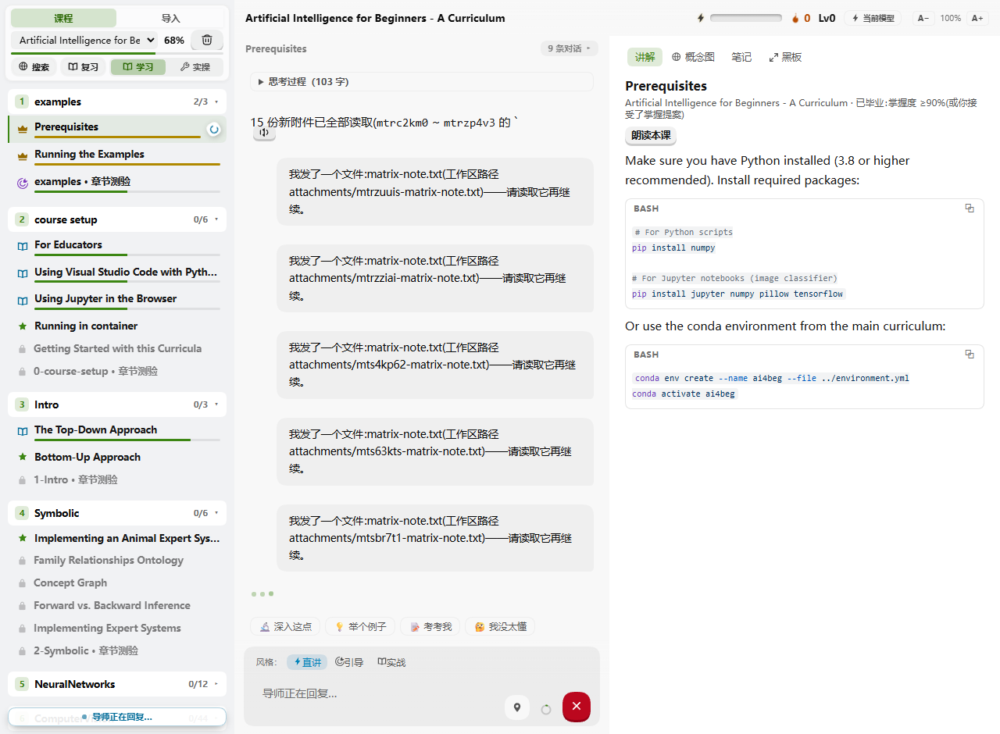
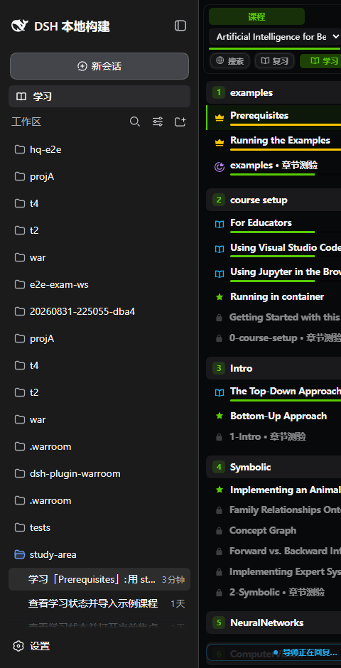
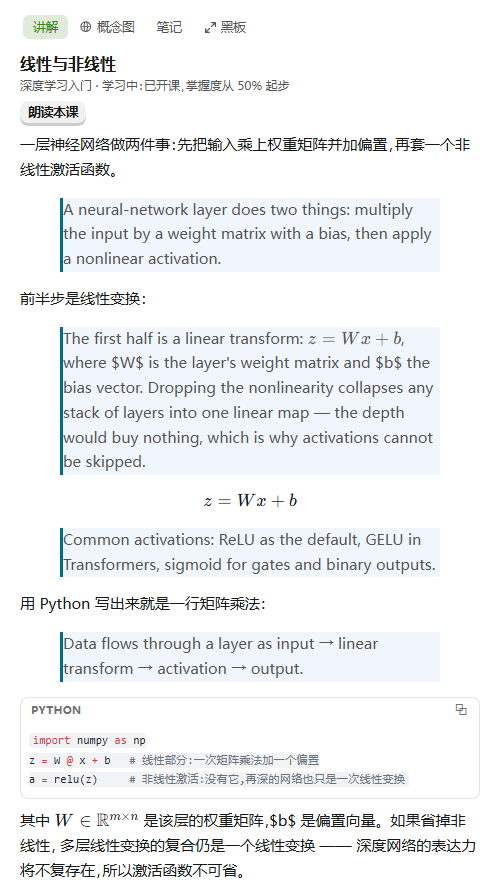
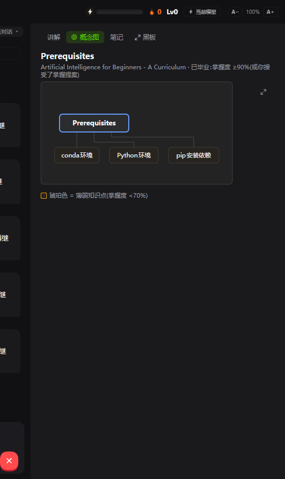

# dsh-plugin-lookatstudy

[English](README.md) | **简体中文**

把任意 Markdown 文档、本地文件夹或 GitHub 学习仓库，变成 [DeepSeek Harness](https://github.com/deepseek-ai/deepseek-harness)（dsh）里的一门引导式课程——你的 dsh 智能体成为一位具备 [LookatStudy](https://github.com/Kaiji-Z/LookatStudy) 交互设计的完整 AI 导师：逐概念的知识追踪、掌握度驱动推进、间隔重复、掌握度提案、卡点感知、学习者记忆、康奈尔笔记、对话内提案卡、星级考试模式、XP 与连击打卡、双语课程、朗读（Edge TTS，离线回退系统语音），以及一块内容丰富的黑板（KaTeX 公式、语法高亮代码、mermaid 图、脑图与概念图视图）。学习引擎模块自 LookatStudy（MIT）vendored 而来。

## 截图

<p align="center">
  
</p>
<p align="center"><b>「学习」面板</b> — 1:1 复刻 LookatStudy 的 UI（面板实时跟随宿主的深浅色切换）：悬浮的 XP/连击应用头、三栏表面阶梯（课程栏 / 导师 / 黑板，按色阶递进）、3D 按压式按钮、对话中的打字动画；从侧栏的「学习」行打开。</p>

| 图 | 说明 |
|---|---|
|  | **课程栏** — 课程树收敛为安静的列表（有意偏离上游的游戏化地图）：可折叠的章节头带完成/总数，课时行携带状态角标（锁定 / 可学 / 进行中 / 已掌握皇冠 / 紫色考试），行内掌握度进度条、到期徽标、流式转圈，每种状态都有悬停解释；聚焦行品牌色描边。 |
|  | **讲解** — 服务端消毒后的 Markdown 按需富渲染：KaTeX 公式、语法高亮代码（共享的复制按钮代码块）、mermaid 图带可缩放画布舞台（CDN 加载，离线静默降级），存在译文时还有双语逐段对照。 |
|  | **🕸 概念图** — 本课的知识组件排布成 draw.io 风格的概念图（内置 ELK 布局，无外部服务）；弱项（掌握度 <70%）琥珀色标出。 |

## 安装

```sh
dsh plugin add dsh-plugin-lookatstudy        # 从 npm
# 或从本地 tarball：
dsh plugin add ./dsh-plugin-lookatstudy-0.2.1.tgz
```

任意 profile 可用。在 `web` profile 里，插件还会挂载学习页的 HTTP API 并加载浏览器侧；headless profile 只获得纯工具面。

## 两个使用面

**1. 导师（对话）。** 直接和智能体说："导入 https://github.com/microsoft/AI-For-Beginners 教我第 1 课"、"今天有什么要复习的"。导师人格（稳定内核 + 三选一灵魂——`guide` 引导 / `direct` 直讲 / `practice` 实战）驱动完整的 LookatStudy 循环：

- **知识组件（KC）** — 首次讲授一课时，导师提炼 2–7 个概念（`study_define_concepts`）；每次判分的作答都归因到概念（`study_record_answer` 携带 `concept`）；逐概念跑 BKT，**课时掌握度 = 最弱概念**——测验优先打 ⚡弱项。
- **掌握度驱动推进** — ≥50% 提前解锁下一课；≥90% 毕业并排入首次 SM-2 复习；作答同时微调复习计划。
- **掌握度提案（propose → apply）** — ≥85% 加上一段可信的费曼式讲解，导师提议提前毕业并**等待学习者表态**；只有明确的决定才生效。
- **卡点感知** — 困惑/阻塞/沮丧被静默记录（`study_report_friction`），以 ⚡😣 弱点呈现。
- **学习者记忆** — 三个槽位（全局风格 / 单课程模式 / 单课缺口），读-合并-写（`study_remember`）。
- 动态**学习者快照**（聚焦、策略段、弱概念、卡点、记忆、到期数、待决提案）每轮作为运行时上下文注入。

**2. 学习面板（`dsh.client`）。** dsh 侧栏里的一个「学习」行（在「新会话」下方，与其他插件入口并列）打开一块全接管面板——排布一如上游 LookatStudy 自己的应用：三栏穿着上游 v0.28 皮肤（LookatStudy 原样 token 阶梯挂在 `.lks-ui` 作用域下，宿主 chrome 表面则 ride 宿主的 `--dsw-*` token），实时跟随宿主深浅色；关闭面板（或导航到任何会话）立刻把中栏还给宿主：

| 栏 | 你得到什么 |
|---|---|
| 左 · 课程 | 课程选择器、进度、带一键开复习的到期盒、课时树（门控、掌握度条、⚡😣 弱点、可点击聚焦）、空态一键示例导入 |
| 中 · 导师 | 导师对话自带输入区——面板从不碰 dsh 的宿主输入框。发送（或点开场白）是进入课时线程的唯一入口：面板在休眠态时先激活学习面，在宿主上创建该课时的会话，经宿主会话 face 发问；回复从会话事件窗口流回，经插件的 Markdown 管线渲染。灵魂胶囊（直讲/引导/实战）挂在栏头；导师的测验选项（A–D）在最新回复下渲染成可点击的作答按钮 |
| 右 · 黑板 | 聚焦课时的讲解（服务端消毒 Markdown，按需富渲染：KaTeX / 语法高亮 / mermaid）、同一课时的 🕸 概念图、康奈尔笔记三区（每条笔记可经武装确认后删除）、朗读条——朗读本课通过微软 Edge 神经语音逐句朗读（宿主侧合成，磁盘缓存；离线回退浏览器系统语音），当前句子高亮 |

在课程栏点击课时只是**聚焦**——进度更新、黑板切换，零模型流量（与上游完全一致的交互）。只有你发送消息，导师才会介入。课程树的每个角标、标签、掌握度条都带悬停说明。

**0.16–0.18 对齐轮**把上游其余表面补齐到 1:1：锚定在功劳卡片上的庆祝粒子、exam-v2 五态流（生成中 → 就绪 → 作答（逐题计时 + KC 标签）→ 星级结算（KC 分解 + 回顾）→ 重考；中途导航有离开守卫拦截）、可内联作答的流内产物卡、安装器式进度屏的分栏导入页、选区转笔记锚点与 回到原文 定位、复习面、带世界切换的全文搜索、ErrorBoundary 护栏的 Markdown 与共享的可复制代码块、逐消息朗读与句子卡拉 OK（n/total）、附件（回形针/粘贴 → 学习工作区 → 导师引用作答）、输入区上的上下文用量 + 模型 chip、Cmd+K 课时面板、已开课时线程的切换器、A−/A+ 缩放档位，以及 C1 滚动契约（粘性跟随、流式脉冲的回底 FAB、生成中的停止按钮）。

**0.20 修订轮**回应了一整轮面板评审：伴学生物彻底移除（老板决定）、章节考试移入中栏并以整栏宽度进行、无标签的线程药丸条收敛为一颗带标签的 chip（「{n} 条对话」）点开带当前标记的菜单、tooltip 在 A−/A+ 缩放下精确贴住光标，上下文用量改为宿主自己的排布——发送键旁的悬停圆环，其上限读的是宿主侧解析出的**真实**模型容量（组合的默认模型 → 提供方目录），点开的面板把用量分解为系统/工具/对话。

全部学习状态来自对 `/lookatstudy/api/state` 的一个共享 3 秒轮询。宿主恰好就是对话模型 + 智能体回合引擎；面板拥有 UI，宿主拥有循环。

## dsh 原生集成面

除面板之外，插件还骑在宿主自己的集成点上：

- **双语 UI** — 客户端整体注册 `lookatstudy` locale 命名空间（zh/en，键位对齐有测试保证）；切换宿主语言，学习面板跟着切。
- **设置页** — 宿主设置壳里的一个 `settings.section` 条目：教学风格、学习模式开关、只读统计（课程/XP/连击）与状态文件路径。
- **`/study` 命令** — 裸 `/study` 激活休眠安装并排队开场白；`/study <text>` 排队该请求。斜杠命令可用之处皆可用。
- **输入框 dock 胶囊** — `conversation.composer.dock` 条目，激活时显示 ⚡到期 · 🔥连击 · Lv（休眠时不渲染）。
- **对话页工具卡** — 按键控 `tool.call.toolview` 注册：`study_record_answer`（✓/✗ + 概念）、`study_lesson`、`study_due_reviews`、`study_exam_result`。
- **启动档预取** — `dsh.client.immediately: true`，侧栏「学习」行首帧即渲染，无需再拉 bundle。

## 工具面（31）

导入：`study_import_markdown` / `study_import_folder`（12 种文档格式，含 EPUB/DOCX/PPTX/PDF 文本）/ `study_import_github`（jsDelivr CDN，github.com 不可达处可用）/ `study_import_url`（文章、arXiv、视频元数据）+ `study_apply_design`（导师设计结构协议）
学习：`study_courses`（进度 + 全文搜索）、`study_map`、`study_lesson`
进度：`study_define_concepts`、`study_record_answer`、`study_complete_lesson`、`study_exam_result`（星级）
产物（0.15.0）：`study_generate_quiz`（交互练习卡）、`study_pose_guess`、`study_compare_table`、`study_draw_diagram`（mermaid）、`study_code_walkthrough`——各以面板内卡片渲染并沉淀进黑板
记忆：`study_consolidate`、`study_translate_lesson`（双语课程）、`study_export`（课程包 Markdown）
提案：`study_propose_mastery`、`study_resolve_proposal`
复习：`study_due_reviews`、`study_record_review`
感知：`study_report_friction`、`study_remember`、`study_notes`、`study_note_save`
杂项：`study_set_mode`、`study_delete_course`

## 配置（cordis.yml patch 层）

```yaml
- id: lookatstudy
  name: dsh-plugin-lookatstudy
  config:
    mode: guide          # direct | guide | practice — 初始灵魂；此后持久化于状态
    statePath: ''        # 默认：$DSH_HOME/lookatstudy-plugin/state.json
```

## 有意未恢复的部分

伴学生物未移植（0.15.0 出过一版极简 DOM 形态，0.19 之后按老板决定移除）。文本持久高亮经文本搜索锚点移植（选区 → 提问这段/加到笔记，引用串恢复为标记）。朗读本身已移植（0.13.0）——Edge 神经语音宿主侧合成，浏览器 speechSynthesis 兜底。其余一切——引擎、契约、数据模型、星级考试、XP 与连击、双语翻译、图片内联、数学/代码/图形渲染——均已移植（图形渲染器按需从 CDN 加载，离线静默降级）。

## 开发

```sh
pnpm exec tsdown        # 构建 lib/（宿主 + 客户端入口，peers external）
pnpm test               # node:test 用例直接跑真源码（无需 key）

# 对着活的 dsh 迭代（需要 deepseek-harness checkout）：
pnpm dsh web --patch ../dsh-plugin-lookatstudy/cordis.dev.yml   # 在 harness checkout 里跑
# 然后打开服务地址，点侧栏的「学习」行
```

布局：人格 + 快照上下文在 `src/index.ts`，工具在 `src/tools.ts`，状态迁移在 `src/state.ts`，学习页 HTTP API 在 `src/dashboard.ts`，消毒 Markdown 在 `src/markdown.ts`（宿主路由与客户端 bundle 共用），浏览器半在 `src/client/`（`index.ts` 注册、`shell-entry.ts` DOM 侧栏行 + 中栏接管、`panel.tsx` 上游排布的三栏、`session-feed.ts` 会话事件窗口 → 聊天行的折叠、`data.ts` 共享轮询 store、`styles.ts` 注入 `--dsw-*` 样式表），UI 卡片投影在 `src/cards.ts`，零依赖引擎 vendored 在 `src/vendor/`（见各文件 provenance 头；文件夹扫描器去重键的那一处本地改动就地有档）。

发布注意：`exports` 必须保留 `"./package.json": "./package.json"`——web bundle 的客户端模块扫描器靠它发现 `dsh.client` 浏览器半。把重建的 tarball 重装进 profile 时，先移除旧版或升版本号（pnpm 对同 spec 的 tarball 会复用缓存）。

## 许可证

MIT。引擎模块自 LookatStudy（MIT）vendored。
